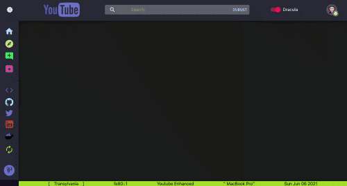
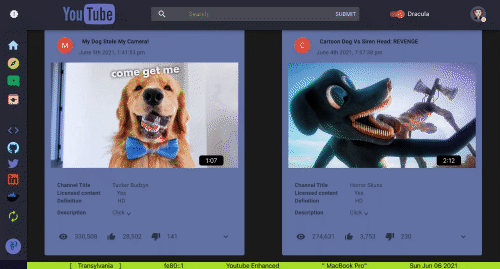
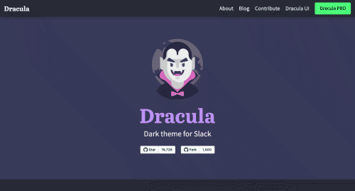

# <a id="menu">Youtube with Material-UI</a>


## Dependencies
<div>
  &ensp;
  &ensp;
  &ensp;
  &ensp;
  &ensp;
  &ensp;
  &ensp;
  &ensp;
  &ensp;
  &ensp; 
  
</div>
<br />


##  Youtube React Enhanced
*   [Description](#description)
     -  [Deployment](#deployment)
*   [Youtube Dracula](#youtube-dracula)
*   [Case Study - Youtube MacOs](#case)

<hr />

### <a id="description">Description</a>

*   **`Challenge`**
    -   Create a react app that searches for YouTube videos using the [YouTube API](https://developers.google.com/youtube/v3), then choose a video from a list to     watch.
    -   `Advantages`
        - Less response time
        - Extended video description
        - Custom UX / UI
        - No publicity
         
    -   `Disadvantages`
        - Limited amount of searches per day  
        - Slightly less options
         
    -   `UX / UI`
        - ***This version of Youtube was inspired by***
            -  🧛🏻‍♂️&ensp;[Dracula Theme](https://draculatheme.com/)
            -  &ensp;[Tmux Terminal](https://github.com/tmux/tmux/wiki)
            -  &ensp;[Material-UI](https://material-ui.com/)      

*   <a id="deployment">**`Deployment`**</a>
    
    -   `Netlify`
         <details><summary>Deploying a React App (Frontend) to Netlify</summary> 
         <br />
  
         -    ```bash=
              Sign up for a Netlify Account
              ```
         -  Go to [Netlify](https://app.netlify.com/signup) and sign up for an account using your GitHub account.
         -  Once you have an account and are logged in. Lets install `netlify-cli` globally
              ```bash=
              npm install -g netlify-cli
              ```
         -  This will gives the `netlify` command that we will use to deploy our app. Lets bundle/compile our React App
              ```bash
              npm run build
              ```
         -  This will take some time. This command will compile our App into a few files and put them in a folder called `build/` Our compiled app has all the code we wrote for our app but it is often uglified/minified to save space and protect our code of being inspected. Once building its is done we can inspect the build folder.
         -  Login in netlify with `netlify-cli`
         -    ```bash
              netlify login
              ```
         </details>
         
        - Continuous Deployment \[ [Tutorial - 1](https://github.com/joinpursuit/Netlify-CRA-Cont-Deploy-Guide)&ensp;,&ensp;[Tutorial - 2](https://dev.to/easybuoy/deploying-react-app-from-github-to-netlify-3a9j) \]      
        
        <br />
        
        <details><summary>Set Up API Key for Continuous Deployment</summary>
        <br />
  
        Don't forget to add your API Key

        Using the Netlify website, go to the `Build and deploy` tab. Under the Environment section select `edit variables` - make sure that the name of your  environment variables matches exactly what you have in your app. In the previous instructions, we said to name it `REACT_APP_API_KEY`. Then add your key from the Chrome Developer Console for the YouTube app as the value. 

        Be sure to start your environmental values with `REACT_APP_`. [See create-react-app documentation for more details](https://create-react-app.dev/docs/adding-custom-environment-variables/#adding-development-environment-variables-in-env)

        <br />

        </details>
        <details><summary>Alternative Deploy step by steps</summary>
        <br />
  
        While in your react app:

          ```bash
          netlify deploy
          ```

        Follow the prompts in the terminal. This will take some time but by the end your app should be deployed. For further detail keep reading:

        Choose "Create & configure a new site". You can use your arrow keys to cycle through the options and press enter to make your selection. 

        When asked with directory type `build`. This will give a sample URL to check your site. When you're ready to deploy to production run: `netlify deploy —prod` 

        Again type "build" when asked which directory. 

        Congrats! Your site should now be deployed. 
  
        <br />
  
        ### Set Up Redirects, So that Links to Specific Views like About or an Individual Video work

        In your `create-react-app`, go to the `public` folder
        - create a file called  `_redirects`  (exact, no extensions)
        - add

            ```
            /* /index.html 200
            ```

        Be sure to add, commit, push and test it.
        </details>
        
    <br />
    
    -   `Docker`
         <details><summary>Create a Docker Image</summary> 
         </details> 

<hr />

## <a id="youtube-dracula">Youtube Dracula</a>
<br />

*   #### `Search`
    <div align="center">
    
    
    </div>
    <br />
    <div align="center">
    
    
    </div>
    
*   #### `Theme Inspiration`
    <div align="center">
    
    
    </div>
    <br />
    <div align="center">
    
    
    </div>
    
<hr />

### <a id="case">Case Study - Youtube Enhanced on MacOs</a>
<br />

This is a quick guide of how to start a `react` app using `Material-UI` open-source, front-end framework.

  - Create a React app
   ```bash
      npx create-react-app youtube-enhanced
      cd youtube-enhanced/
      git init
   ```
  - Install imagemagick for MacBook - Big Sur 
   ```bash
      brew install imagemagick
         
      "ImageMagick depends on Ghostscript fonts. To install them type : "
         
      brew install ghostscript
   ````
  - Add the Font link to the html page at `'./public'`
    ```javascript
    <link rel="stylesheet" href="https://fonts.googleapis.com/icon?family=Material+Icons" />
    ```
  -   Create the Icons for the App, Android and iOS friendly.
       -  Using a third party site that provides the SVG file
          -  use magick convert the SVG file to ICO with name favicon.ico
         -    `
               magick -density 256x256 -background transparent favicon.svg -define icon:auto-resize -colors 256 favicon.ico
              ` 
       -  Using a third party site [Maskable](https://maskable.app/editor)
          - with the SVG >> upload, select masks & controls >> export 192x192 & 512x512 png images
          - save png images to youtube-enhanced/public

   - Push the Changes from terminal to GitHub
      - Add & commit locally
        ```bash
        (echo "/node_modules" ; echo ".DS_Store" ; echo ".env\n.env.local\n.env.development.local\n.env.test.local\n.env.production.local" ) >> .gitnignore
        git add .
        git commit -m "First commit"
        ```
      - On Github, create a new repository, & add upstream locally
         ```bash
         git checkout main
         git remote -v
         git remote add upstream 'insert repo'
         git remote -v
         git pull upstream main
         ```
   <br />


  - Install dependency [Material-UI](https://material-ui.com/getting-started/installation/)
      ```bash
         npm i @material-ui/core
         npm i @material-ui/icons
      ```
   - Install `react-router-dom`
      ```bash
         npm i --save react-router-dom
      ```
   - Install `youtube-react`
      ```bash
         npm i react-youtube
      ```
   - Install `moment`
      ```bash
         npm i --save moment react-moment
         npm i moment-duration-format
      ```
   - Install `uuidv4`
      ```bash
         npm i --save uuid
      ```
   - Install `axios`
      ```bash
         npm i axios
      ```
   - Install `local-ip-url`
      ```bash
         npm i local-ip-url --save-dev
      ```
      ```javascript
         const localIpUrl = require('local-ip-url')
         localIpUrl() // => 192.168.31.69
         localIpUrl('public', 'ipv6') // => fe80::c434:2eff:fe06:f90
      ```
###  Happy Coding!
<br /> 
<div align="center">
  
 ####   [Up](#menu) &emsp;&emsp;&emsp;&emsp;[PompaDonpa](https://github.com/PompaDonpa) &emsp;&emsp;&emsp;&emsp;[LinkedIn](https://www.linkedin.com/in/dev-danielnaranjo/) &emsp;&emsp;&emsp;&emsp;[Twitter](https://twitter.com/PompaDonpa) &emsp;&emsp;&emsp;&emsp;[Daniel Naranjo](https://pompadonpa.github.io/)
  
</div>
